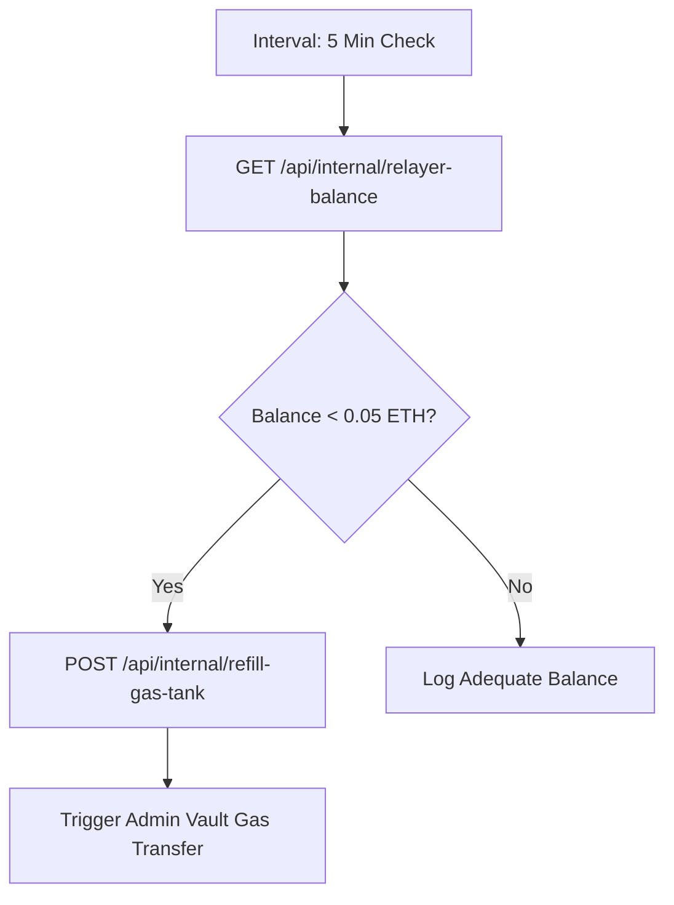

# ⛽ Truxify Relayer Gas Tank Refiller & Alerting System

This n8n automated workflow manages native gas token reserves for transaction relayer wallets.

## Features
- 5-minute cron check interval execution
- Dynamic gas threshold triggers
- Automated administrative vault gas top-up execution
