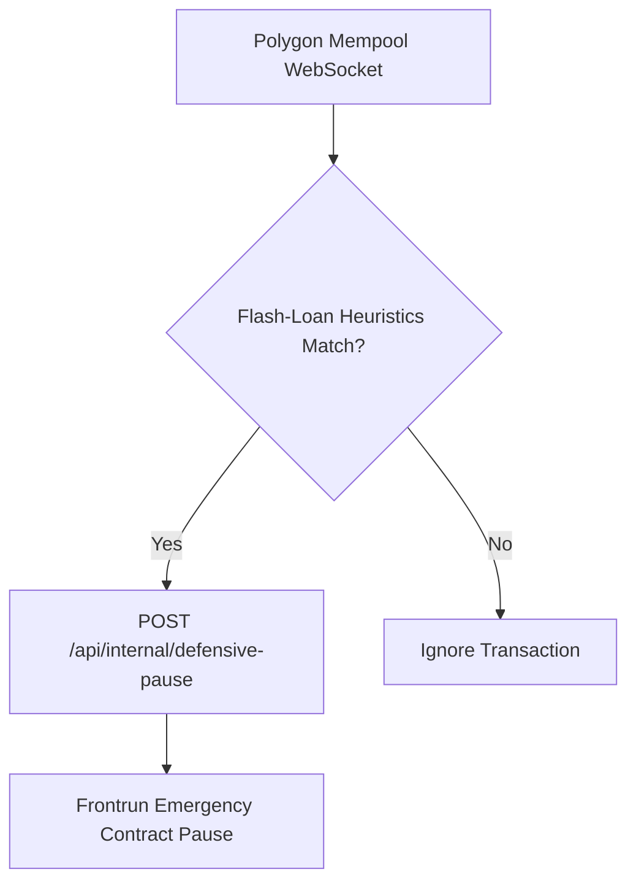

# 🛡️ Truxify Smart Contract Security Sentinel Workflow

This n8n workflow monitors pending Polygon mempool transactions to protect `TruxifyEscrow.sol` from flash-loan manipulation and re-entrancy attack profiles.

## Features
- Mempool real-time WebSocket ingestion
- High-gas anomalies detection
- Automated frontrun pause defense triggering

## Authentication
`POST /api/internal/defensive-pause` sits behind `requireApiKey` like every other
`/api/internal` route, so the pause node attaches the **Truxify Internal API Key**
`httpHeaderAuth` credential. Without it the API answers 401 and the defensive
pause never fires (#13925).

The endpoint is one-way: it only ever *opens* the escrow circuit breaker. Closing
it is an operator action — `POST /api/internal/pause-escrow {"paused": false}`.
