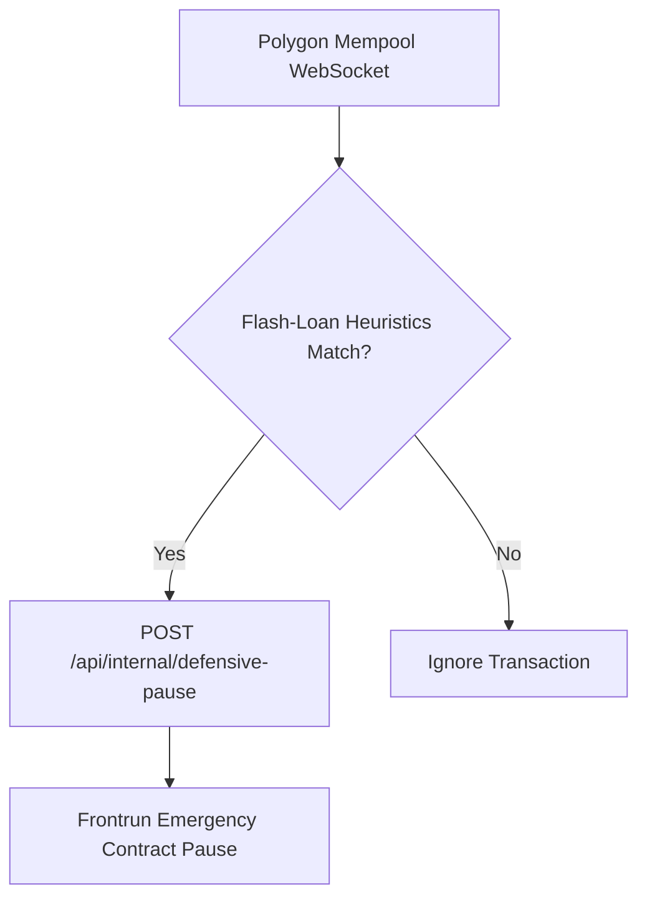

# 🛡️ Truxify Smart Contract Security Sentinel Workflow

This n8n workflow monitors pending Polygon mempool transactions to protect `TruxifyEscrow.sol` from flash-loan manipulation and re-entrancy attack profiles.

## Features
- Mempool real-time WebSocket ingestion
- High-gas anomalies detection
- Automated frontrun pause defense triggering
