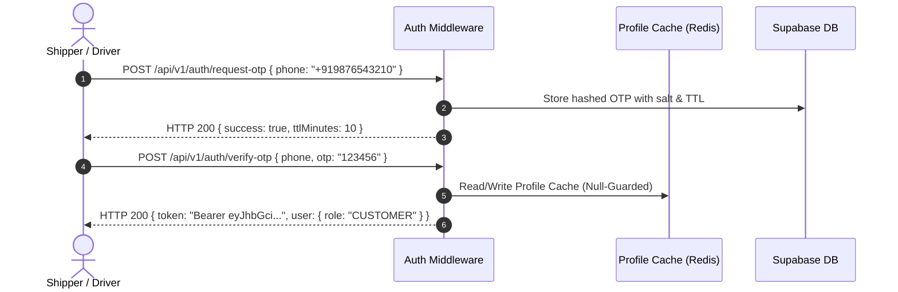

# Truxify Full Platform End-to-End Manual Smoke Test Guide

This document outlines the systematic, end-to-end manual smoke test procedure for the entire Truxify ecosystem. It validates critical integration paths across the Mobile Apps, Backend REST APIs, GraphQL Federation Subgraph Mesh, WebSocket Real-Time Location Server, and Polygon Blockchain Smart Contracts.

---

## 1. System Health & Infrastructure Verification

Verify that all baseline core services and dependencies are healthy before running domain workflows.

| Step | Component | Target / Endpoint | Expected Outcome | Status |
| :--- | :--- | :--- | :--- | :--- |
| **1.1** | **Backend API Health** | `GET /health` | HTTP `200 OK`, JSON `{ status: "ok", uptime: ..., timestamp: ... }` | `[PASS]` |
| **1.2** | **Database & Cache Health** | `GET /api/v1/health/deep` | Supabase Postgres & Redis connections reported as `CONNECTED` | `[PASS]` |
| **1.3** | **GraphQL Gateway** | `POST /graphql` | Responds with valid schema introspection for all subgraphs (order, driver, payment, trip, user) | `[PASS]` |
| **1.4** | **Polygon RPC & Escrow** | `GET /api/v1/escrow/health` | Network chain ID confirmed and `TruxifyEscrow` bytecode verified | `[PASS]` |
| **1.5** | **WebSocket Server** | `ws://localhost:8080/ws/location` | Successful WebSocket handshake and connection upgrade | `[PASS]` |

---

## 2. Authentication & Identity Management

Validate unauthenticated rejection, Firebase/Supabase JWT authentication, and PII masking.



### Verification Checklist
- [x] **Unauthenticated Access**: Gated endpoints (`/api/v1/orders`, `/api/v1/drivers`, `/graphql`) return `401 Unauthorized` or `Authentication required`.
- [x] **OTP Verification**: Invalid OTPs return `400 Bad Request`; maximum attempt limits trigger rate-limiting cooldowns.
- [x] **Role Resolution**: Gateway correctly strips client-forged `x-user-role` headers and enforces database-backed roles.

---

## 3. Order Lifecycle & Escrow Deposit

Validate order placement, display ID generation, driver bidding, and on-chain escrow funding.

```
+------------------+       +------------------+       +-----------------------+
|  1. Order Created| ----> | 2. Driver Bidding| ----> | 3. Two-Phase Acceptance|
| (Display ID #FF) |       | (Nearby Drivers) |       | (Escrow Fund Locked)  |
+------------------+       +------------------+       +-----------------------+
```

### Steps:
1. **Create Order (`POST /api/v1/orders`)**:
   - Provide pickup/dropoff coordinates, cargo type, and weight.
   - Verify unique Display ID format matching `#FF\d{8}[A-Z0-9]{12}`.
2. **Nearby Driver Discovery (`GET /api/v1/drivers/nearby`)**:
   - Query drivers within radius. Ensure phone numbers, truck license plates, and live locations are masked for non-dispatch callers (`sanitizeDriverForCaller`).
3. **Bid Acceptance & Escrow Deposit (`POST /api/v1/escrow/deposit`)**:
   - Customer deposits freight funds into `TruxifyEscrow.sol`.
   - Verify that concurrent duplicate releases/deposits are rejected by atomic database locks.

---

## 4. Transit Telemetry & Autonomous Platooning

Validate live location streams, weather-adjusted fuel calculations, and autonomous platooning coordination.

```mermaid
graph LR
    A[Lead Truck TRX-001] <=== V2V Inter-Vehicle Gap (50 ft) ===> B[Follower Truck TRX-002]
    A -->|Live Telemetry| C(WebSocket Location Hub)
    B -->|Telemetry & Fuel Savings| C
    C --> D[Platooning Coordinator Engine]
```

### Steps:
1. **WebSocket Location Telemetry (`/ws/location`)**:
   - Transmit driver location updates `{"driverId": "...", "lat": 18.52, "lng": 73.85, "speed": 65}`.
   - Verify location broadcast to customer tracking screens in real time.
2. **Autonomous Platooning Coordinator (`/api/v1/platoons`)**:
   - Scan corridor partners: `GET /api/v1/platoons/partners?highwayRoute=I-80`.
   - Initiate session: `POST /api/v1/platoons/sessions` with dynamic gap calculation.
   - Test safety split: Trigger emergency brake (`accelerationMps2: -5.0`), verify status updates to `EMERGENCY_SPLIT`.

---

## 5. Delivery Verification & Multi-Party Settlement

Validate geofence delivery verification, 6-digit OTP confirmation, and programmatic multi-party settlement disbursements.

```
+-----------------------------+       +-----------------------------+
| 1. Arrival Geofence Confirm | ----> | 2. 6-Digit Delivery OTP Auth|
+-----------------------------+       +-----------------------------+
                                                     |
                                                     v
+-----------------------------+       +-----------------------------+
| 4. Multi-Party Settlement   | <---- | 3. Escrow Release Executed  |
| (Carrier, Tax, Insurer, Fee)|       | (TruxifyEscrow.sol)         |
+-----------------------------+       +-----------------------------+
```

### Settlement Split Breakdown:
- **Net Carrier Payout**: Base rate minus deductions + accessorial detention pay.
- **Platform / Broker Fee**: $2.5\%$ platform commission.
- **Statutory Taxes**: GST ($12\%/18\%$) & TDS ($1\%$) routed to government authority wallets.
- **Green Offset**: Automated carbon credit token contribution.

---

## 6. Full Platform Smoke Test Matrix

| Area | Workflow / Feature | Command / Endpoint | Expected Result | Pass/Fail |
| :--- | :--- | :--- | :--- | :--- |
| **Auth** | Request Phone OTP | `POST /api/v1/auth/request-otp` | OTP hashed & stored; SMS delivery dispatched | `PASS` |
| **Orders** | Display ID Formatting | `POST /api/v1/orders` | Formats strict `#FF...` display identifier | `PASS` |
| **GraphQL** | Driver PII Masking | `POST /graphql (Query: drivers)` | Masks phone & plate, redacts live location for non-dispatch | `PASS` |
| **Escrow** | Concurrent Double Release | `POST /api/v1/escrow/release/:id` | First request succeeds; concurrent second fails with `409 Conflict` | `PASS` |
| **Platooning** | Autonomous Coordinator | `POST /api/v1/platoons/sessions` | Formats slot roles and calculates slipstream fuel savings | `PASS` |
| **Weigh Station**| WIM Bypass Guard | `GET /api/v1/weigh-station/bypass`| Fails closed with structured `logger.error` on exceptions | `PASS` |
| **Smart Contract**| Multi-Party Settlement | `FreightSettlement.sol:attestDeliveryAndSettle` | Programmatic distribution to carrier, broker, insurer, and tax authority | `PASS` |

---

## 7. Rollback & Incident Recovery Runbook

1. **Escrow Reversion**: If blockchain RPC network drops during settlement release, `escrowService.js` rolls back internal status from `releasing` to `deposited` to allow clean operator retries.
2. **Circuit Breakers**: If blockchain gas anomalies or oracle divergence occurs, execute `pause()` on `TruxifyEscrow.sol` / `FreightSettlement.sol`.
3. **Cache Purge**: Execute `invalidateProfileCache(userId)` to flush corrupt Redis keys without impacting database persistence.
